# Memory Game

* In this game the player tries to match all the like animals by clicking on the box.
* The game is designed for all age groups.
* This game is fun and interactive.

## Demo

* [view the live website Here]( https://maish79.github.io/memory-game/)

* 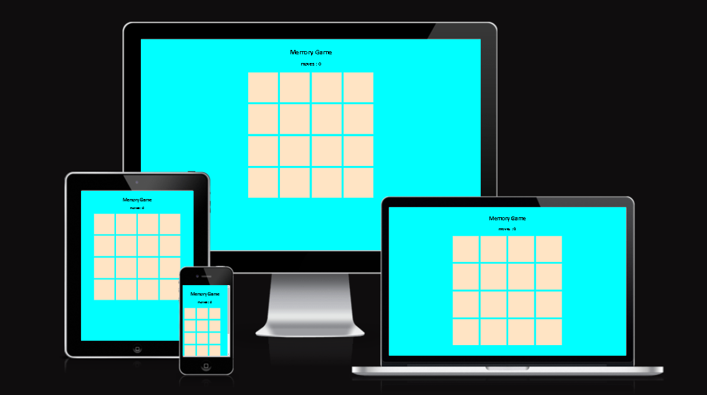

## Table of Content

+ [How to play the Game](#How-to-play-the-Game)
+ [WireFrames](#WireFrames)
+ [Game Levels and alerts](#Game-levels-and-alerts)
+ [Testing](#Testing)
+ [Deloyment](#Deployment)
+ [Credits](#Credits)

## How to play the Game

* The player should see 16 grid graycards and a moves counter at the screen on display.
* The player clicks on the cards to find a matching pair.
* After clicking the cards the moves counter starts counting the moves.
* If correctly matched pairs are clicked you get a pop-up alert saying ('you found a match').
* The player should click on the "X" button after the pop-up so as to continue with the game.
* When all cards are correctly matched you get another pop-up saying ('congradulations you win!')
* After the game ends, a restart button becomes visible for playing another round.
* By playing this game the user can test their memory skills in a fun environment.

## WireFrames 
Balsamiq wireframes were used for laptop and mobile devises during initial visual development

* balsamiq-mobile display

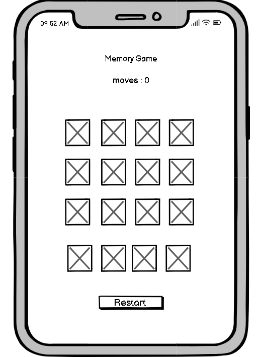

* balsamiq-laptop display

 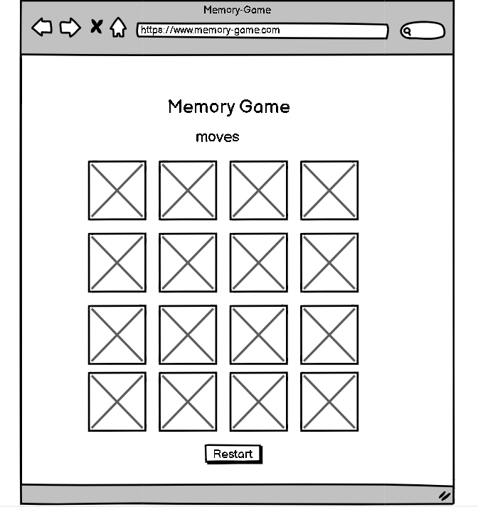

## Game Levels and alerts

* Matched pair Game alert

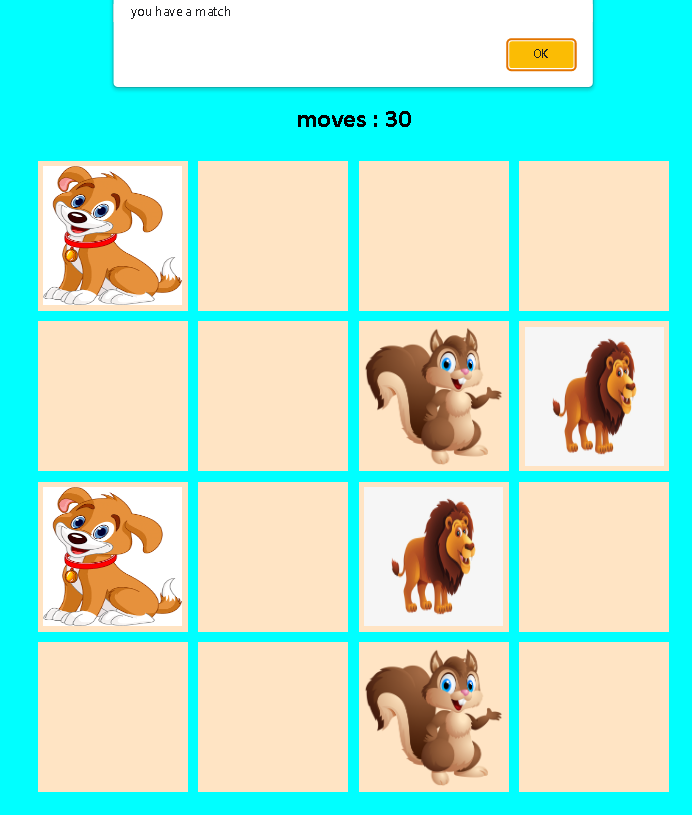
 
* End game congradulations alert

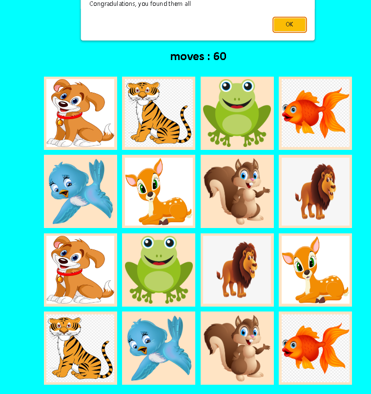

* End game with Restart button

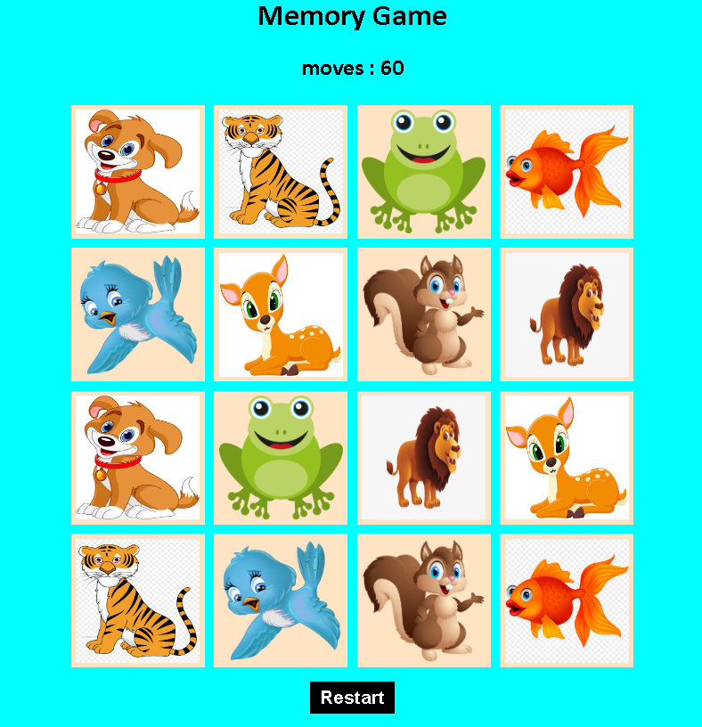

## Testing
* No errors were passed through the HTML Validator

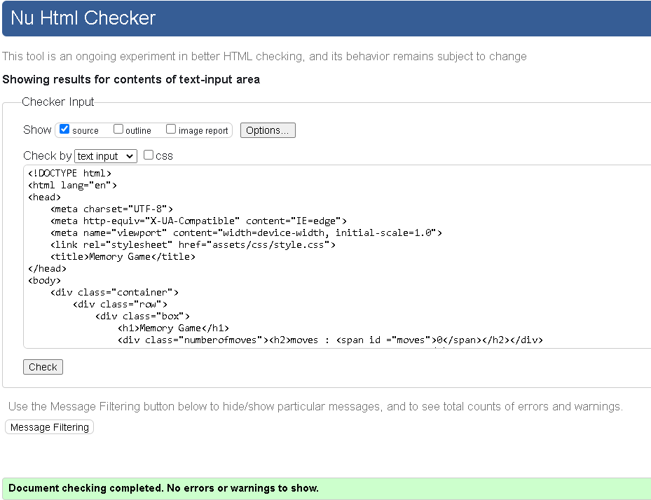

* No errors were passed through the CSS Validator

* JSHint testing

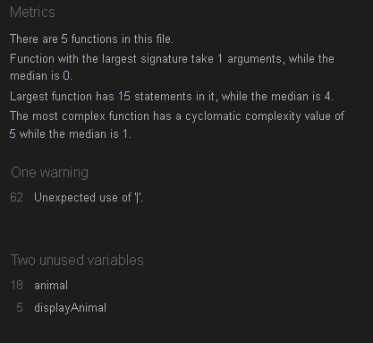

# Lighthouse Testing
I used google lighthouse testing tools for the debsites performance.

* Lighthouse Desktop

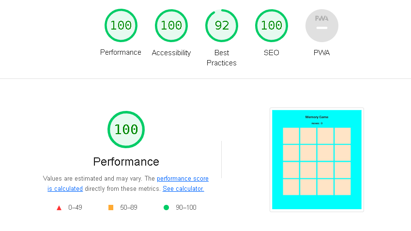

* lighthouse Mobile

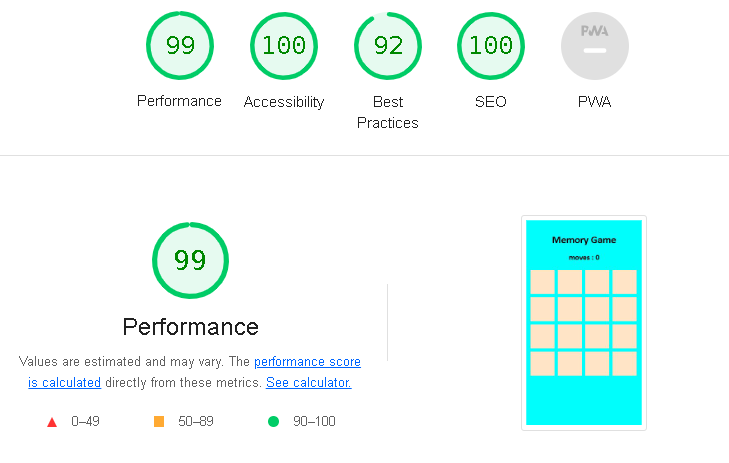

## Languages Used
1. [HTML](https://en.wikipedia.org/wiki/HTML5) - To create a basic site.
2. [CSS](https://en.wikipedia.org/wiki/CSS) - To create the look for the game.
3. [JavaScript](https://en.wikipedia.org/wiki/JavaScript) - For the logic of the game. To manipulate the HTML and CSS on the screen..

## Framework Libraries and Programme Used

* [Balsamiq Wireframes](https://balsamiq.com/wireframes/) - for creating Wireframes for initial visual development.
* [GitHub](https://github.com/) - used to host repository.
* [GitPod](https://gitpod.io/workspaces) - used to develop project and organise version control.
* [Google Chrome Development Tools](https://developers.google.com/web/tools/chrome-devtools) - for testing code on various device sizes during development and debugging.
* [Lighthouse](https://developers.google.com/web/tools/lighthouse) - for testing code health, accessibility, speed and search engine optimisation.

## Testing

* I tested the page works in different browsers.
* I have confirmed that the project is responsive across various screen sizes. 

Pixel-5

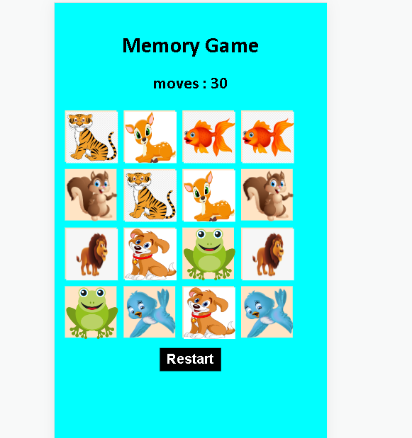

Nest-hub

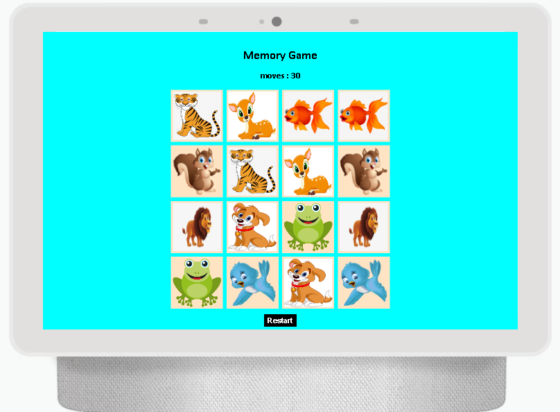

## Deployment

Deployments through Github Pages
The site was deployed through github using the following steps:
* Log into GitHub.
* Locate the repository.
* Click the "settings" option along the options bar.
* Then go to "Pages" tab in the left hand side sidebar.
* Then under "Source" click the "None" dropdown and select the "Main" branch
* Click the save button.
* The page will update and at the top it will say: "Your site is live at https://maish79.github.io/memory-game/"

## Credits

Code 

* Moirahartigan for ReadMe section inspiration.
* [youtube](https://www.youtube.com/watch?v=28VfzEiJgy4) inspiration was taken from this tutorial.
* [w3schools](https://www.w3schools.com/) was used as a general source of knowledge 
* [Stack Overflow](https://stackoverflow.com/) was used to assist during debugging.

Media

* Media animal cartoon images were taken from google.

 

 

